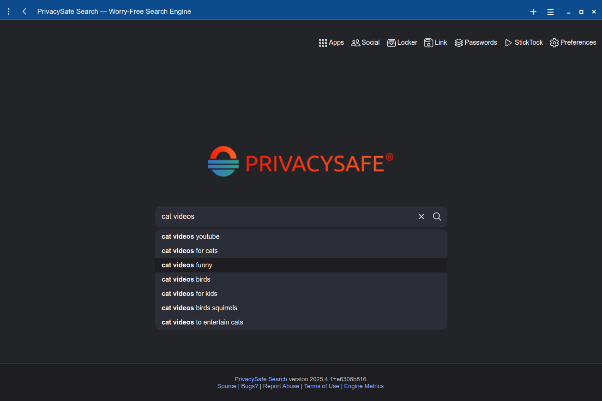
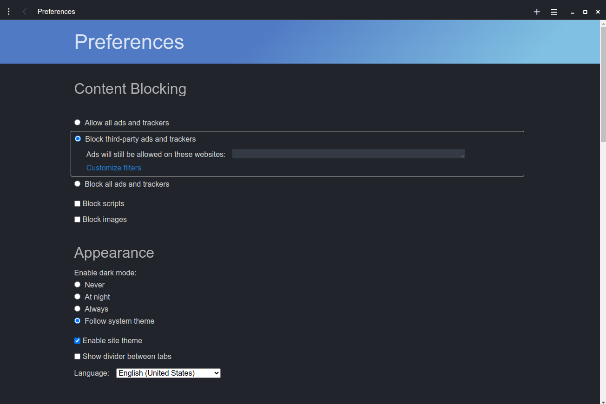
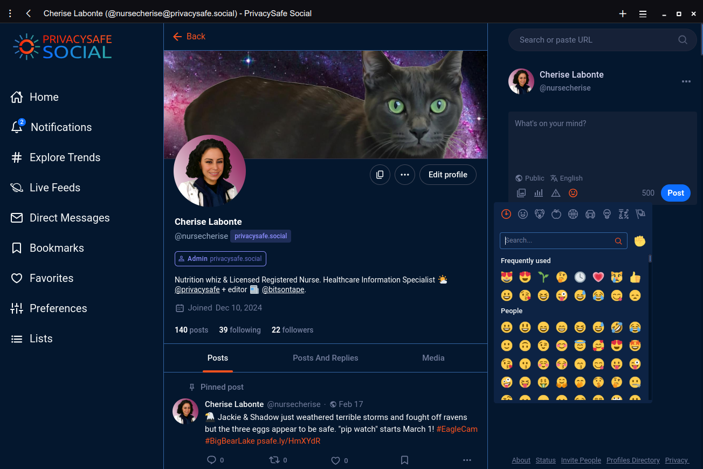
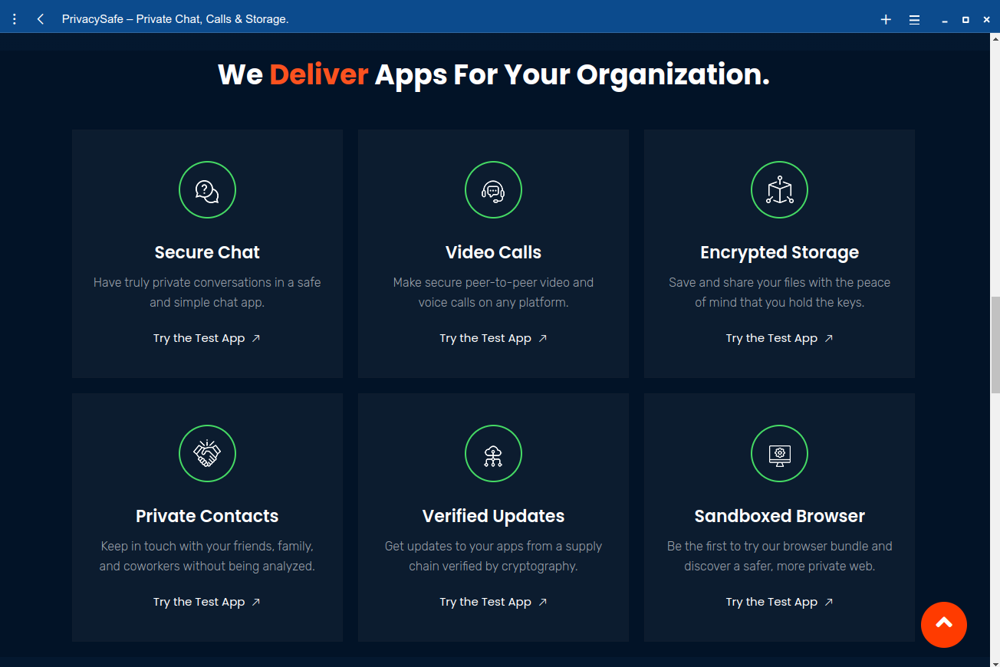
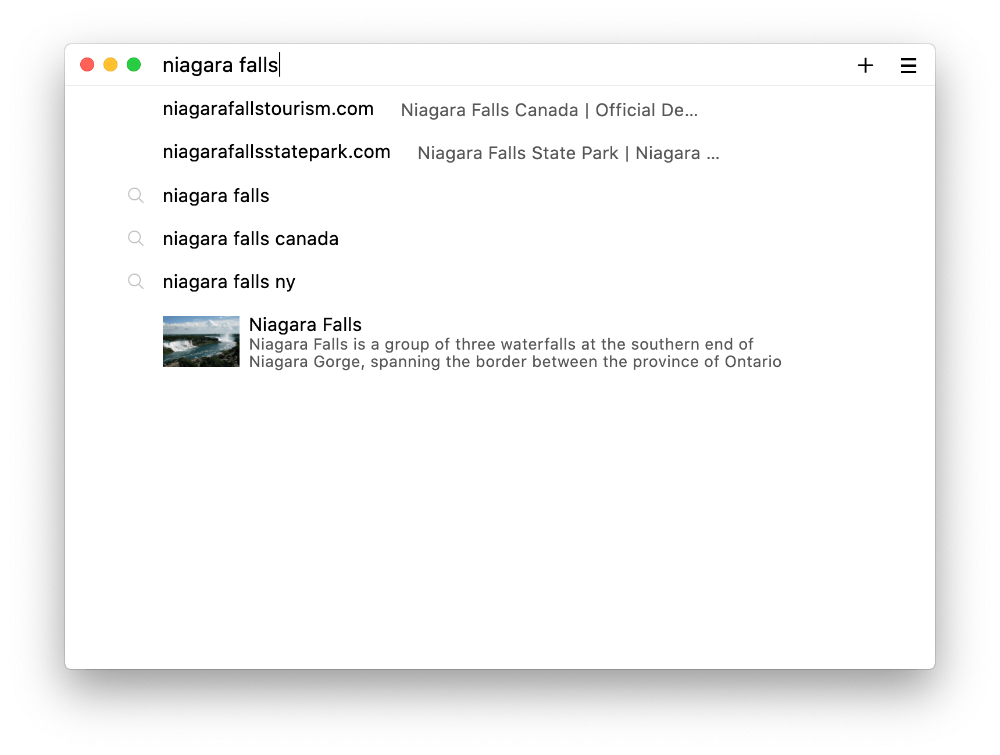
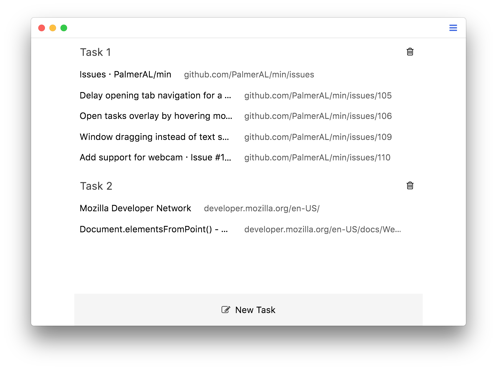
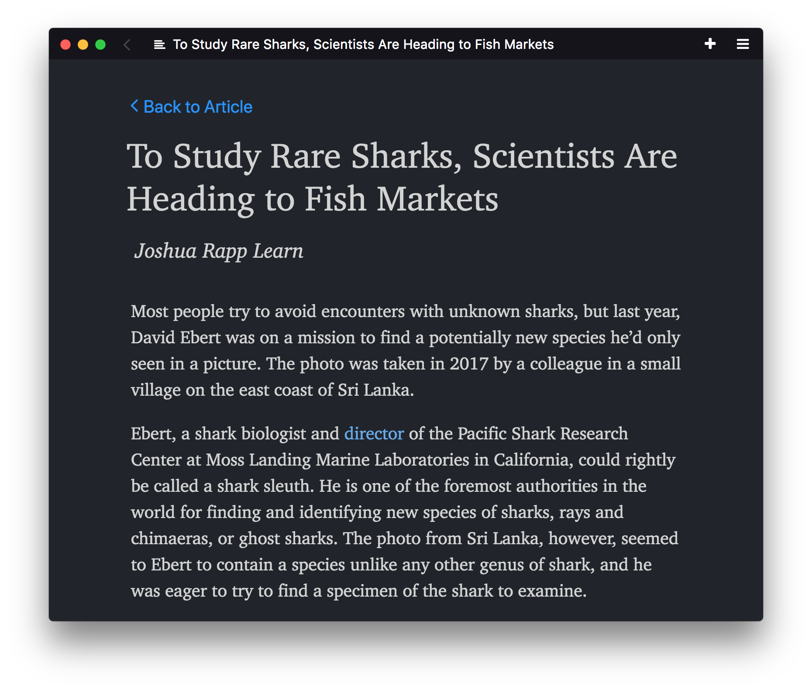

  
  
  # RefreshView Browser &ndash; Your Internet Refreshed

Remember when the web was simple? We bring you faster loading without Big Tech or AI tracking. Browse with built-in ad blockers, safer social apps, private search & better security. RefreshView is a fast, minimal browser with an interface designed to minimize distractions, and features such as:

- Full-text search for visited pages
- Ad and tracker blocking
- Automatic reader view
- Tasks (tab groups)
- Bookmark tagging
- Password manager integration
- Dark theme

Download RefreshView from the [releases page](https://github.com/PrivacySafe/refreshview-browser/releases), or learn more on the [website](https://refreshview.com).

## Screenshots

## Connecting Social Communities
We designed a gorgeous dashboard that seamlessly connects you with a global ecosystem, integrating with apps like [PrivacySafe Social](https://privacysafe.social). Join a thriving community of over 1,000 servers and millions of users on the decentralized Mastodon network. RefreshView Browser is still in alpha testing, but you can [Sign Up for PrivacySafe Social Now](https://privacysafe.social).

## Power Under the Hood
RefreshView bundles our suite of [PrivacySafe apps](https://privacysafe.app) with features like tree-style tabs, workspace switching & sidebar bookmarks.

## Worry-Free Search Engine
RefreshView Search indexes 82 sources and delivers results with no ads or user profiling.

## Installing

You can find prebuilt binaries for RefreshView [here](https://github.com/PrivacySafe/refreshview-browser/releases). Alternatively, skip to the section below for instructions on how to build RefreshView directly from source.

### Installation on Linux

- To install the .deb file, use `sudo dpkg -i /path/to/download`
- To install the RPM build, use `sudo rpm -i /path/to/download --ignoreos`
<!-- - On Arch Linux install from [AUR](https://aur.archlinux.org/packages/min-browser-bin). -->
<!-- - On Raspberry Pi, you can install RefreshView from [Pi-Apps](https://github.com/Botspot/pi-apps). -->

## Getting Started

<!-- * The [wiki](https://github.com/PrivacySafe/refreshview-browser/wiki) provides an overview of the the features available in RefreshView, a list of available keyboard shortcuts, and answers to some [frequently asked questions](https://github.com/PrivacySafe/refreshview-browser/wiki/FAQ). -->
* RefreshView supports installing userscripts to extend its functionality. See the [userscript documentation](https://github.com/PrivacySafe/refreshview-browser/wiki/userscripts) for instructions on writing userscripts, as well as a collection of scripts written by the community.
<!-- * If you have questions about using RefreshView, need help getting started with development, or want to talk about what we're working on, join our [Discord server](https://discord.gg/bRpqjJ4). -->

## Developing

If you want to develop RefreshView:

- Install [Node](https://nodejs.org).
- Run `npm install` to install dependencies.
- Start RefreshView in development mode by running `npm run start`.
- After you make changes, press `alt+ctrl+r` (or `opt+cmd+r` on Mac) to reload the browser UI.

### Building binaries

In order to build RefreshView from source, follow the installation instructions above, then use one of the following commands to create binaries:

- `npm run buildWindows`
- `npm run buildMacIntel`
- `npm run buildMacArm`
- `npm run buildDebian`
<!-- - `npm run buildRaspi` (for 32-bit Raspberry Pi) -->
<!-- - `npm run buildLinuxArm64` (for 64-bit Raspberry Pi or other ARM Linux) -->
- `npm run buildRedhat`

Depending on the platform you are building for, you may need to install additional dependencies:

- If you are building a macOS package, you'll need to install Xcode and the associated command-line tools. You may also need to set your default SDK to macOS 11.0 or higher, which you can do by running `export SDKROOT=/Applications/Xcode.app/Contents/Developer/Platforms/MacOSX.platform/Developer/SDKs/MacOSX11.1.sdk`. The exact command will depend on where Xcode is installed and which SDK version you're using.
- To build on Windows, you'll need to install Visual Studio. Once it's installed, you may also need to run `npm config set msvs_version 2019` (or the appropriate version).

### Getting Help

If you're experiencing a bug or have a suggestion for how to improve RefreshView, please open a [new issue](https://github.com/PrivacySafe/refreshview-browser/issues/new/choose).

### Contributing Code

- Start by following the development instructions listed above.
<!-- - The wiki has an [overview of RefreshView's architecture](https://github.com/PrivacySafe/refreshview-browser/wiki/Architecture). -->
- RefreshView uses the [Standard](https://github.com/feross/standard) code style; [most editors](https://standardjs.com/#are-there-text-editor-plugins) have plugins available to auto-format your code.
- If you see something that's missing, or run into any problems, please open an issue!

### Contributing Translations

#### Adding a new language

- Find the language code that goes with your language from [this list](https://source.chromium.org/chromium/chromium/src/+/main:ui/base/l10n/l10n_util.cc;l=55) (line 55 - 230).
- In the `localization/languages` directory, create a new file, and name it "[your language code].json".
- Open your new file, and copy the contents of the <a href="https://github.com/PrivacySafe/refreshview-browser/blob/master/localization/languages/en-US.json">localization/languages/en-US.json</a> file into your new file.
- Change the "identifier" field in the new file to the language code from step 1.
- Inside the file, replace each English string in the right-hand column with the equivalent translation.
- (Optional) See your translations live by following the [development instructions](#installing) above. RefreshView will display in the same language as your operating system, so make sure your computer is set to the same language that you're translating.
- That's it! Make a pull request with your changes.

#### Updating an existing language

- Find the language file for your language in the `localization/languages` directory.
- Look through the file for any items that have a value of "null", or that have a comment saying "missing translation".
- For each of these items, look for the item with the same name in the `en-US.json` file.
- Translate the value from the English file, replace "null" with your translation, and remove the "missing translation" comment.
- Make a pull request with the updated file.

## Licensing
RefreshView is a remixed version of [Min browser](https://minbrowser.org) by [PalmerAL](https://github.com/sponsors/PalmerAL). [Sponsor Min Development](https://github.com/sponsors/PalmerAL)

RefreshView is licensed under [Apache License version 2.0](LICENSE.txt)
